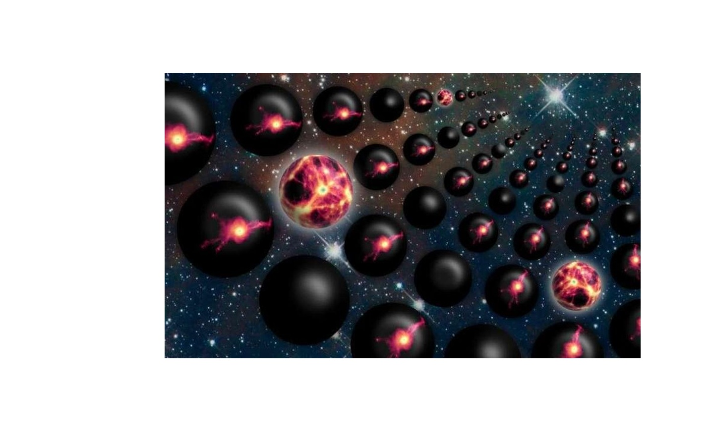
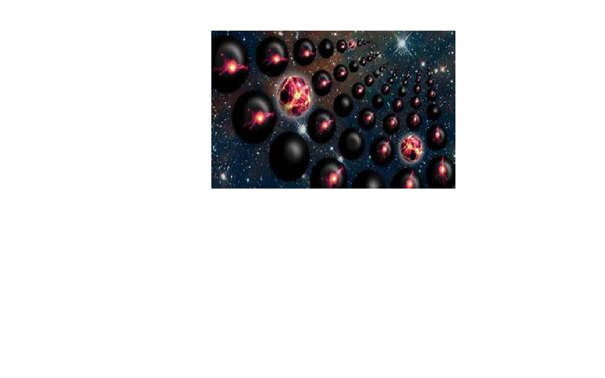
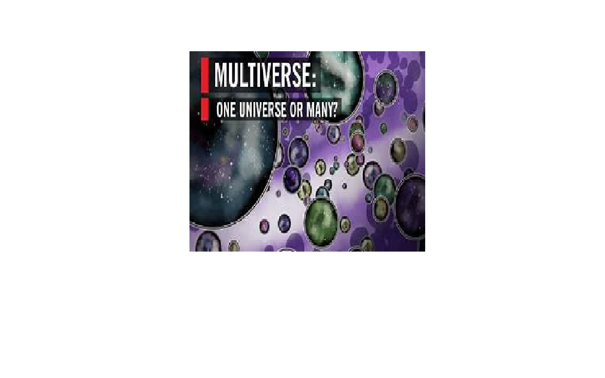
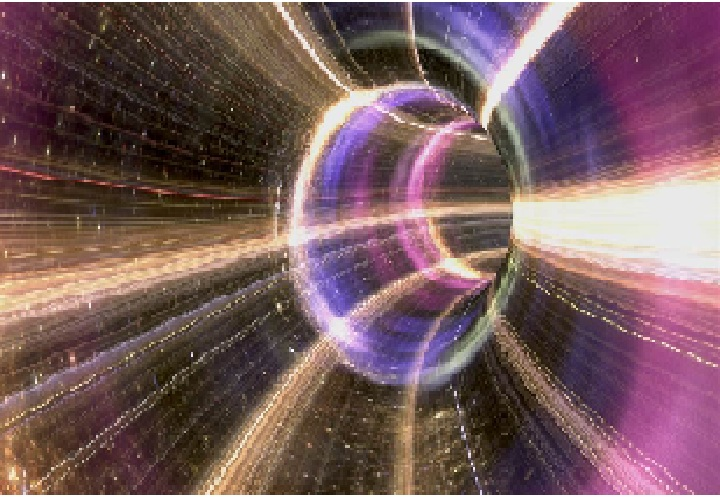
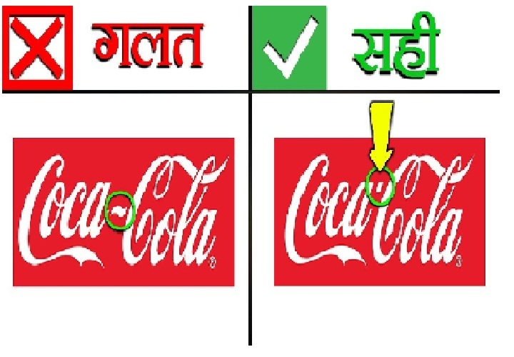
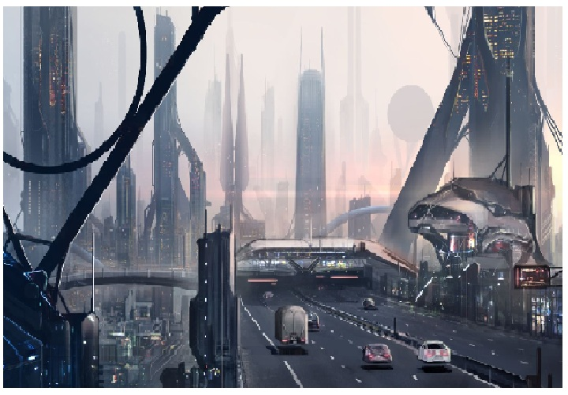

<!DOCTYPE HTML>
<!--
	Story by HTML5 UP
	html5up.net | @ajlkn
	Free for personal and commercial use under the CCA 3.0 license (html5up.net/license)

	Note: Only needed for demo purposes. Delete for production sites.
-->
<html>
	<head>
		<title>Amazing Facts</title>
		<meta charset="utf-8" />
		<meta name="viewport" content="width=device-width, initial-scale=1, user-scalable=no" />
		<link rel="stylesheet" href="assets/css/main.css" />
		<noscript><link rel="stylesheet" href="assets/css/noscript.css" /></noscript>
	</head>
	<body class="is-preload">

		<!-- Wrapper -->
			

				<!-- Banner -->
					<section class="banner style1 orient-left content-align-left image-position-right fullscreen onload-image-fade-in onload-content-fade-right">
						

							<h1>Amazing Facts</h1>
							
<h4>We are here to discus and know about some amazing facts.we are taking the first topic for the amazing facts is Multiverse and Parallel Universe.</h4>

							<ul class="actions stacked">
								<li><a href="#first" class="button large wide smooth-scroll-middle">Get Started</a></li>
							</ul>
						

						

							
						

					</section>

				<!-- Spotlight -->
					<section class="spotlight style1 orient-right content-align-left image-position-center onscroll-image-fade-in" id="first">
						

							<h2>Parallel Universe</h2>
							
A parallel universe, also known as a parallel dimension, alternate universe, or alternate reality, is a hypothetical self-contained plane of existence, co-existing with one's own. The sum of all potential parallel universes that constitute reality is often called a “multiverse". While the three terms are generally synonymous and can be used interchangeably in most cases, there is sometimes an additional connotation implied with the term "alternate universe/reality" that implies that the reality is a variant of our own, with some overlap with the similarly-named alternate history. The term "parallel universe" is more general, without implying a relationship, or lack of relationship, with our own universe. A universe where the very laws of nature are different – for example, one in which there are no Laws of Motion – would in general count as a parallel universe but not an alternative reality and a concept between both fantasy world and earth.

							<ul class="actions stacked">
								<li><a href="C:\Users\Lenovo\Desktop\HTML\html5up-story\Parallel Universe.html" class="button">Learn More</a></li>
							</ul>
						

						

							
						

					</section>

				<!-- Spotlight -->
					<section class="spotlight style1 orient-left content-align-left image-position-center onscroll-image-fade-in">
						

							<h2>Multiverse</h2>
							
The multiverse is a hypothetical group of multiple universes. Together, these universes comprise everything that exists: the entirety of space, time, matter, energy, information, and the physical laws and constants that describe them. The different universes within the multiverse are called "parallel universes", "other universes", or "alternate universes".

							<ul class="actions stacked">
								<li><a href="C:\Users\Lenovo\Desktop\HTML\html5up-story\Multiverse.html" class="button">Learn More</a></li>
							</ul>
						

						

							
						

					</section>

				<!-- Spotlight -->
					<section class="spotlight style1 orient-right content-align-left image-position-center onscroll-image-fade-in">
						

							<h2>Difference between Parallel universe and multiverse</h2>
							
The difference between The Multiverse and Parallel Universe is that the Multiverse is a collection of Parallel Universes. The Multiverse theory states there are multiple versions of the universe, each slightly different from the other.

							<ul class="actions stacked">
								<li><a href="C:\Users\Lenovo\Desktop\HTML\html5up-story\Difference Between Parallel Universe andmultiverse.html" class="button">Learn More</a></li>
							</ul>
						

						

							
						

					</section>

					<!-- Spotlight -->
					<section class="spotlight style1 orient-left content-align-left image-position-center onscroll-image-fade-in">
						

							<h2>Similarity between parallel Universe and Multiverse</h2>
							
Here the notion "parallel" can make some sense. At least, it's possible to compare the items in some way (by the distance between two points/universes). Talking of universes as parallel in the very general case of items in a multiverse, when there is no similarity at all between these items, would be a bit too lax in my eyes.

							<ul class="actions stacked">
								<li><a href="C:\Users\Lenovo\Desktop\HTML\html5up-story\Similarities Between Parallel Universe and Multiverse.html" class="button">Learn More</a></li>
							</ul>
						

						

							
						

					</section>

				<!-- Gallery -->
					<section class="wrapper style1 align-center">
						

							<h2>Gallery</h2>
						

						<!-- Gallery -->
							

								<article>
									
									

										<ul class="actions fixed">
											<li><a embed href="https://youtu.be/5PTOn72VTNU" class="button small">Time Travel</a></li>
										</ul>
									

								</article>
								<article>
									
									

										<ul class="actions fixed">
											<li><a embed href="https://youtu.be/UvyfGp2lqho" class="button small">Teleportation</a></li>
										</ul>
									

								</article>
								<article>
									
									

										<ul class="actions fixed">
											<li><a embed href="https://youtu.be/rAE1ug8ne9Y" class="button small">The Mandela Effect</a></li>
										</ul>
									

								</article>
								<article>
									
									

										<ul class="actions fixed">
											<li><a embed href="https://youtu.be/lXlGrOC3K40" class="button small">The Hypothesis of Future</a></li>
										</ul>
									

								</article>
							
							

					</section>

				<!-- Items -->
					<section class="wrapper style1 align-center">
						

							<h2>Items</h2>
							

								<section>
									
									<h3>Time Travel</h3>
									
Lorem ipsum dolor sit amet, consectetur adipiscing elit. Morbi dui turpis, cursus eget orci amet aliquam congue semper. Etiam eget ultrices risus nec tempor elit.

								</section>
								<section>
									
									<h3>Teleportation</h3>
									
Lorem ipsum dolor sit amet, consectetur adipiscing elit. Morbi dui turpis, cursus eget orci amet aliquam congue semper. Etiam eget ultrices risus nec tempor elit.

								</section>
								<section>
									
									<h3>The Mandela Effect</h3>
									
Lorem ipsum dolor sit amet, consectetur adipiscing elit. Morbi dui turpis, cursus eget orci amet aliquam congue semper. Etiam eget ultrices risus nec tempor elit.

								</section>
								<section>
									
									<h3>The Hypothesis of Future</h3>
									
Lorem ipsum dolor sit amet, consectetur adipiscing elit. Morbi dui turpis, cursus eget orci amet aliquam congue semper. Etiam eget ultrices risus nec tempor elit.

								</section>

				<!-- Footer -->
					<footer class="wrapper style1 align-center">
						

							<ul class="icons">
								<li><a href="#" class="icon brands style2 fa-twitter">Twitter</a></li>
								<li><a href="#" class="icon brands style2 fa-facebook-f">Facebook</a></li>
								<li><a href="#" class="icon brands style2 fa-instagram">Instagram</a></li>
								<li><a href="#" class="icon brands style2 fa-linkedin">LinkedIn</a></li>
								<li><a href="#" class="icon style2 fa-envelope">Email</a></li>
							</ul>
							
&copy; Untitled. Design: <a href="https://html5up.net">HTML5 UP</a>.

						

					</footer>

			

		<!-- Scripts -->
			
			
			
			
			
			
			

		<!-- Note: Only needed for demo purposes. Delete for production sites. -->
			

	</body>
</html>
